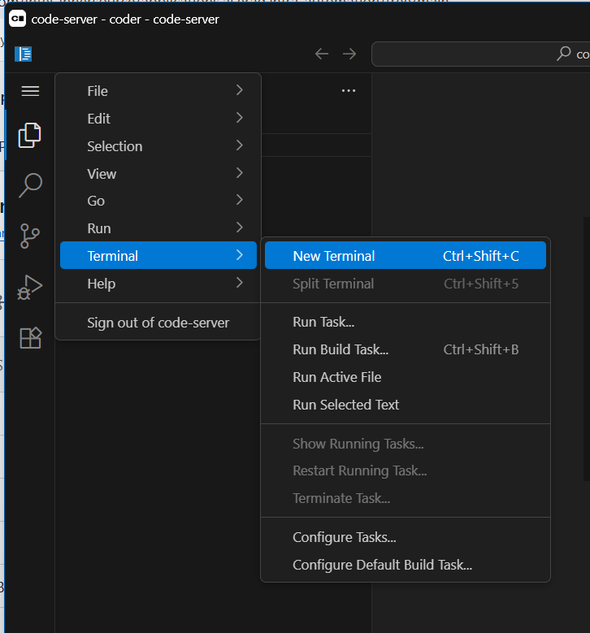
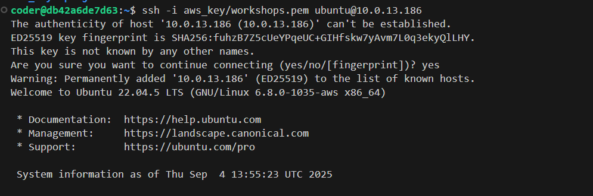

# Single Node Deployment guide

This guide provides step-by-step instructions to deploy Intel® AI for Enterprise Inference on a Single Node.

## Prerequisites
Before running the EI stack automation, we need to have Intel Xeon/Gaudi machine, For this hands-on excercise we will be providing AWS EC2 instances for participants

## EC2 instances
**The EC2 instance type `i7ie` is already created and installed with prerequisites.**

In order to login to EC2 instance you need to have ssh client software installed on your local machine. For ease of use we have hosted VSCode on AWS instance and you don't have to install any software on your local machine.   

Let's get started, please go through the instructions carefully

### Step 1: Login to VSCode
Here are the links to launch your instance of VSCode, each user can pick one instance:


[user1](http://52.24.245.243:9001/)       
[user2](http://52.24.245.243:9002/)       
[user3](http://52.24.245.243:9003/)       
[user4](http://52.24.245.243:9004/)     
[user5](http://52.24.245.243:9005/)     
[user6](http://52.24.245.243:9006/)     
[user7](http://52.24.245.243:9007/)     
[user8](http://52.24.245.243:9008/)     
[user9](http://52.24.245.243:9009/)     
[user10](http://52.24.245.243:9010/)      

### NOTE: Each instance having login page with username displayed and **password is same as the username**.

### Step 2: Login to EC2 instance

once you have logged in to VSCode, open the terminal and run below command to login to the instance.
![]

```
ssh -i aws_key/workshops.pem ubuntu@<EC2-IP>
```


## Setting Up the Enterprise Inference stack
We'll do all this below mentioned steps on **EC2 instance** we just launched from VSCode terminal.

We are using "api.example.com" for this setup, follow steps below:

### Step 1: Modify the hosts file
Since we are testing locally, we need to map a fake domain (`api.example.com`) to `localhost` in the `/etc/hosts` file.

Run the following command to edit the hosts file:
```
sudo nano /etc/hosts
```
Add this line at the end:
```
127.0.0.1 api.example.com
```
Save and exit (`CTRL+X`, then `Y` and `Enter`).

### Step 2: Generate a self-signed SSL certificate
Run the following commands to create a self-signed SSL certificate:
```
mkdir -p ~/certs && cd ~/certs
openssl req -x509 -newkey rsa:4096 -keyout key.pem -out cert.pem -days 365 -nodes -subj "/CN=api.example.com"
```
This generates:
- `cert.pem`: The self-signed certificate.
- `key.pem`: The private key.

### Step 3: Configure the Automation config file
Move the single node preset inference config file to the runnig directory

```
cd ~
git clone https://github.com/opea-project/Enterprise-Inference.git
cd Enterprise-Inference
cp -f docs/examples/single-node/inference-config.cfg core/inference-config.cfg
cp -f docs/examples/single-node/vault.yml core/inventory/metadata/vault.yml
```

### Step 4: Update `hosts.yaml` File
Move the single node preset hosts config file to the runnig directory

```
cp -f docs/examples/single-node/hosts.yaml core/inventory/hosts.yaml
```

### Step 5: Run the Automation
Now, you can run the automation using your configured file.
```
cd core
chmod +x inference-stack-deploy.sh
```
 Export your huggingface token as environment variable. Make sure to replace "Your_Hugging_Face_Token_ID" with actual Hugging Face Token. 
```
export HUGGINGFACE_TOKEN=<<Your_Hugging_Face_Token_ID>>
```
If your node is CPU only with no gaudi run below to deploy llama 3.1 8b model.
```
./inference-stack-deploy.sh --models "21" --cpu-or-gpu "cpu" --hugging-face-token $HUGGINGFACE_TOKEN
```
Select option 1 and confirm the Yes/No Pprompt

If your node has gaudi accelerators run below to deploy llama 3.1 8b model.

> **📝 Note**: If you're using Intel® Gaudi® AI Accelerators, ensure firmware and drivers are up to date using the [automated setup scripts](./gaudi-prerequisites.md#automated-installationupgrade-process) before deployment.

```
./inference-stack-deploy.sh --models "1" --cpu-or-gpu "gpu" --hugging-face-token $HUGGINGFACE_TOKEN
```
Select option 1 and confirm the Yes/No prompt

This will deploy the setup automatically. If you encounter any issues, double-check the prerequisites and configuration files.

### Step 6: Testing the Inference
On the Node run the following commands to test the successful deployment of Intel® AI for Enterprise Inference

```
export USER=api-admin
export PASSWORD='changeme!!'
export BASE_URL=https://api.example.com
export KEYCLOAK_REALM=master
export KEYCLOAK_CLIENT_ID=api
export KEYCLOAK_CLIENT_SECRET=$(bash scripts/keycloak-fetch-client-secret.sh api.example.com api-admin 'changeme!!' api | awk -F': ' '/Client secret:/ {print $2}')
export TOKEN=$(curl -k -X POST $BASE_URL/token  -H 'Content-Type: application/x-www-form-urlencoded' -d "grant_type=client_credentials&client_id=${KEYCLOAK_CLIENT_ID}&client_secret=${KEYCLOAK_CLIENT_SECRET}" | jq -r .access_token)
```
we can use curl commands to test the deployment or we can have openweb ui to chat with the models we just deployed.

To test CPU Inference with curl
```
curl -k ${BASE_URL}/Meta-Llama-3.1-8B-Instruct-vllmcpu/v1/completions -X POST -d '{"model": "meta-llama/Meta-Llama-3.1-8B-Instruct", "prompt": "What is Deep Learning?", "max_tokens": 25, "temperature": 0}' -H 'Content-Type: application/json' -H "Authorization: Bearer $TOKEN"
```
To test on CPU Inference with openwebui follow below steps:

```
# Install OpenWebUI
helm repo add open-webui https://helm.openwebui.com/
helm repo update
helm install open-webui open-webui/open-webui --namespace open-webui --create-namespace

# check is the pod is up and running
kubectl get pods -n open-webui

# Port forward to access OpenWebUI
kubectl port-forward -n open-webui svc/open-webui 7070:80

# Access 
kubectl get svc
```
